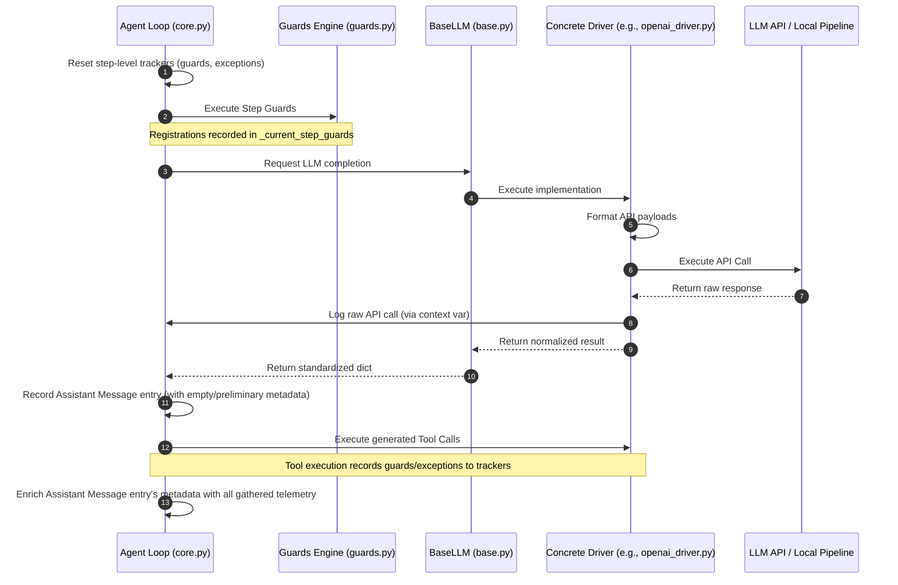

# Logging Improvements Proposal

This proposal outlines the design and implementation plan to improve logging in **dingir**. The goal is to make logs the ultimate source of truth for debugging by capturing raw API payloads, tracking execution contexts, and recording guards and exceptions encountered during agent steps.

---

## 1. Objectives
1. **Raw API Telemetry**: Capture the *exact* request parameters and response data sent to and received from external LLM providers (OpenAI, Gemini, Ollama, Hugging Face Hub, and local Hugging Face pipelines).
2. **Contextual Metadata**: Log the driver name and model configuration used for every LLM interaction.
3. **Assistant Message Tagging**: Tag every assistant message with:
   - The name of the agent that produced it.
   - The driver used to generate the message.
   - All guards encountered (both step-level and tool-level, whether passed or failed) during that execution turn.
   - All exceptions encountered during the turn.
4. **Hierarchical Log Representation**: Maintain clean formatting and serialization to ensure logs are easy to analyze programmatically or read as formatted text.

---

## 2. Telemetry Architecture & Data Flow

The sequence diagram below demonstrates how context tracking and telemetry logging are integrated into the execution path:



---

## 3. Telemetry Schema Designs

### A. Raw API Call Log Entry (`raw_api_call`)
A new entry type `raw_api_call` will be registered in `dingir.agents.log.ENTRY_TYPES`. It contains:
* **`driver`**: The class name of the driver (e.g. `"OpenAI"`, `"Gemini"`).
* **`model_id`**: The target model ID (e.g. `"gpt-4o"`, `"gemini-2.5-flash"`).
* **`request`**: The exact library parameters or HTTP payload structure sent.
* **`response`**: The raw returned response (converted to dict if it is a Pydantic object, or serialized as string if unstructured).

### B. Assistant Message Metadata Tags
The `metadata` field of the `"message"` log entry (for `role: assistant`) will be structured as follows:
```json
{
  "agent_name": "AgentName",
  "driver": "OpenAIDriver",
  "guards_encountered": [
    {
      "name": "IterationLimitGuard",
      "status": "passed",
      "tool_name": null,
      "arguments": null,
      "error": null
    },
    {
      "name": "PathRestrictionGuard",
      "status": "failed",
      "tool_name": "view_file",
      "arguments": {"path": "/etc/passwd"},
      "error": "Access to /etc/passwd is forbidden."
    }
  ],
  "exceptions_encountered": [
    {
      "type": "FileNotFoundError",
      "message": "No such file or directory: 'missing.txt'",
      "context": "tool_execution"
    }
  ]
}
```

---

## 4. Concrete Code Changes

### Phase 1: Context Propagation (`guards.py` & `core.py`)
To avoid breaking APIs, we leverage the existing `_active_agent` context variable in `guards.py`.
1. We will set/reset `_active_agent` at the entry/exit points of `Agent.respond()` and `Agent.stream()`.
2. This ensures that any LLM driver executing within the agent's turn can fetch the active agent via `_active_agent.get()` and log raw payloads.

### Phase 2: Guard & Exception Registration
We add tracking lists and registration methods on the `Agent` class:
* `_current_step_guards: List[Dict[str, Any]]`
* `_current_step_exceptions: List[Dict[str, Any]]`
* `record_guard_encounter(guard, status, tool_name=None, arguments=None, error=None)`
* `record_exception_encounter(exception, context)`

We then instrument the `Guard` hooks (`__call__`, `wrap_tool`) to call `record_guard_encounter`, and standard `try-except` blocks in `core.py` to call `record_exception_encounter`.

### Phase 3: Driver Telemetry Integration
We define `BaseLLM._log_raw_api_call(...)` in `base.py`. Every concrete driver will call this helper inside their `execute` and `execute_stream` methods.

For example, in `openai_driver.py`:
```python
# Synchronous execute
raw_request = {
    "model": self.id,
    "messages": cleaned_messages,
    "params": params,
}
response = self.sync_client.chat.completions.create(...)
raw_response = response.model_dump() if hasattr(response, "model_dump") else str(response)
self._log_raw_api_call(raw_request, raw_response)
```

For streaming `execute_stream`, we log the accumulated payload at the end of the generation (right before yielding the `"done"` chunk).

---

## 5. Verification & Robustness
* **No Crashing on Serialization**: Since raw response payloads can contain complex Pydantic models or non-serializable objects, the logging wrapper will wrap all dictionary conversion calls in safe checks (e.g. calling `model_dump()`, calling `str()`, or checking for JSON serializability) to ensure logging *never* causes execution failures.
* **Compatibility**: Old logs will load without issues as missing telemetry attributes will default to `None` or empty lists.
